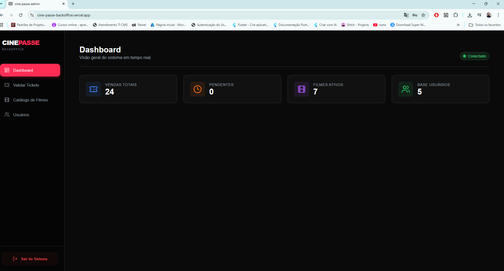
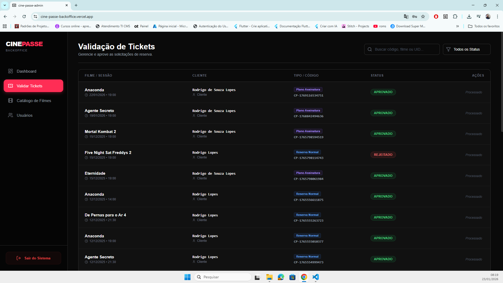
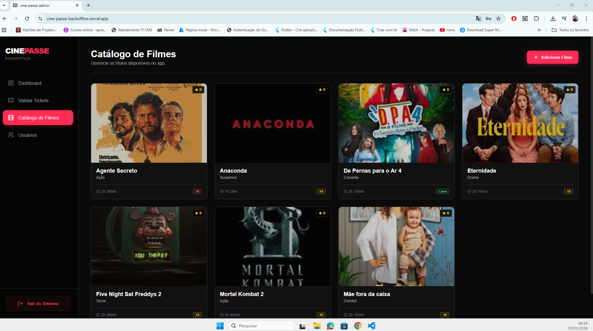
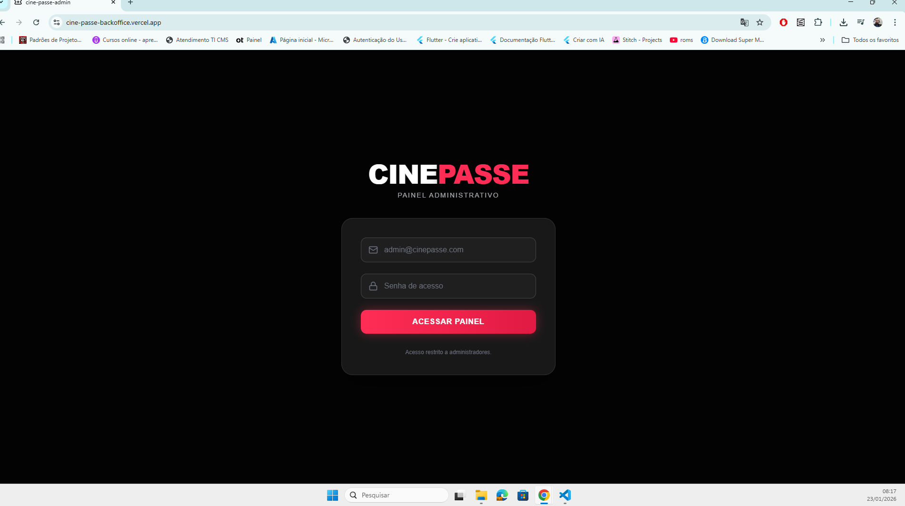
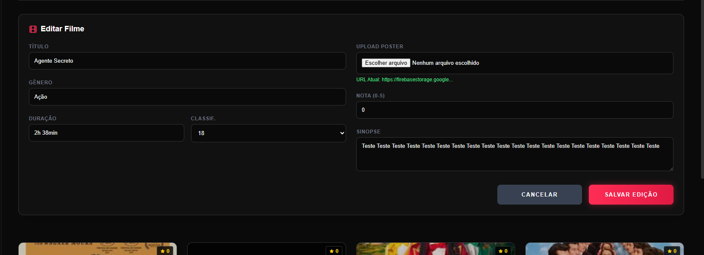
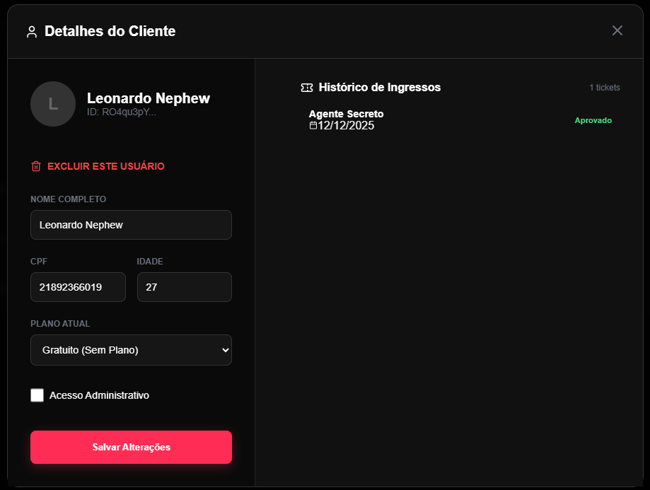

# 🎬 CinePasse Admin (Backoffice)

O **CinePasse Admin** é o painel de controle web responsável pela **gestão operacional da plataforma CinePasse**. Ele permite que administradores validem ingressos, gerenciem o catálogo de filmes e acompanhem métricas do sistema em tempo real.

Este projeto funciona **integrado ao App Mobile CinePasse (Flutter)**, compartilhando o mesmo backend Firebase (Auth + Firestore).

---

## 🖥️ Funcionalidades

### 📊 Dashboard

* Visão geral do sistema em tempo real
* Contadores de vendas, tickets pendentes e usuários ativos
* Indicador de status operacional da plataforma

---

### 🎟️ Validação de Tickets (Core Business)

* Listagem de todas as reservas feitas pelo App Mobile
* **Aprovação**: valida assinatura ou pagamento avulso e libera o ingresso
* **Rejeição**: cancela a reserva
* Filtros por status:

  * Pendente
  * Aprovado
  * Rejeitado
* Busca por código de ticket

---

### 🎬 Catálogo de Filmes

* Adição de novos filmes

  * Título
  * Gênero
  * Poster
  * Sinopse
* Edição de filmes
* Exclusão de filmes
* Atualização instantânea no App Mobile via Firestore Streams

---

### 👤 Gestão de Usuários

* Visualização de usuários cadastrados
* Consulta de dados básicos
* Edição de informações e planos (quando necessário)

---

## 🛠️ Tecnologias Utilizadas

* **Frontend:** React.js + Vite
* **Estilização:** Styled Components (CSS-in-JS)
* **Ícones:** Lucide React
* **Backend:** Firebase Authentication & Firestore

---

## 🚀 Como Rodar Localmente

### ✅ Pré-requisitos

* Node.js 16 ou superior
* Projeto configurado no Firebase

---

### 📥 Instalação

Clone o repositório:

```bash
git clone https://github.com/rodrigosouzalopes94/CinePasse-Backoffice.git
cd CinePasse-Backoffice
```

Instale as dependências:

```bash
npm install
```

Configure o Firebase:

* Crie o arquivo:

  ```
  src/config/firebase.js
  ```
* Insira suas credenciais do Firebase
* Consulte o `FIREBASE_SETUP.md` ou o console do Firebase

Inicie o servidor:

```bash
npm run dev
```

Acesse no navegador:

```
http://localhost:5173
```

---

## 📦 Deploy

O Backoffice do CinePasse já está publicado e disponível online:

🌐 **Acesso em Produção:**
[https://cine-passe-backoffice.vercel.app/](https://cine-passe-backoffice.vercel.app/)


### Build de Produção

```bash
npm run build
```

A pasta `dist/` será gerada e estará pronta para publicação.

---

## 🔐 Segurança e Controle de Acesso

* Acesso restrito ao painel administrativo
* Autenticação via Firebase Auth
* Operações críticas protegidas por **Firestore Security Rules**
* Apenas usuários com permissão de administrador podem:

  * Aprovar/Rejeitar tickets
  * Gerenciar catálogo de filmes
  * Editar usuários

---

## 🖼️ Screenshots do Backoffice

> As imagens abaixo representam as principais telas do painel administrativo.

### 📊 Dashboard

<p align="center">
  
</p>

### 🎟️ Validação de Tickets

<p align="center">
  
  
</p>

### 🎬 Gestão de Filmes

<p align="center">
  
  
</p>

### 👤 Gestão de Usuários

<p align="center">
  
  
</p>

---

## ✅ Considerações Finais

O **CinePasse Admin** garante:

* Controle total das regras de negócio
* Validação humana e segura dos ingressos
* Atualizações em tempo real
* Escalabilidade e segurança para ambiente de produção

Desenvolvido como parte do **ecossistema CinePasse**.
